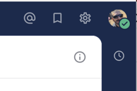
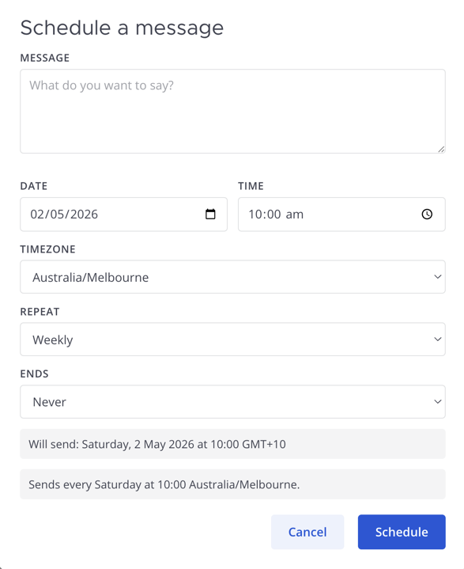
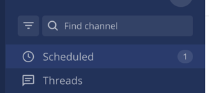
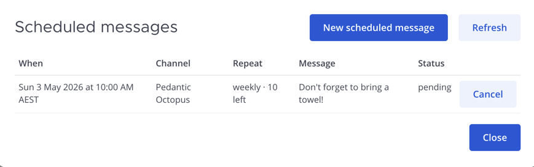

# Mattermost Scheduled Messages Plugin

> **Disclaimer:** This project was built with the guidance of a human developer and implemented primarily by [Claude Code](https://claude.com/claude-code) (Anthropic's AI coding assistant). I didn't have time to dev all of this by hand myself, but did have enough to guide Claude to do so! If LLM-assisted development is something you actively avoid, consider this your fair warning.

## What it does

Adds scheduled-message support to Mattermost **Team Edition** (no enterprise license required). Compose a message now, pick a time, and the plugin posts it on your behalf at the scheduled moment.

Works on web and desktop. Slash command works on **all platforms** including iOS and Android.

## What it looks like

### Channel header

A clock icon appears in every channel's header. Clicking it opens the scheduling modal with a date, time, and timezone picker. The modal pre-fills with sensible defaults (next whole hour in your browser's timezone).





### Left sidebar

A "Scheduled" item appears in the sidebar header. When you have pending scheduled messages it shows a count badge and brightens to match unread items; when you don't it dims to match Threads' resting state. Click it to view, refresh, or cancel pending messages.





### Slash command

```
/schedule "Your message" "2026-06-01 09:30" Australia/Sydney
/schedule "Daily stand-up" "2026-05-04 09:00" repeat=weekdays count=20
/schedule "Monthly invoice" "2026-05-01 10:00" repeat=monthly until=2026-12-31
/schedule list
/schedule cancel <id>
```

Timezone defaults to your Mattermost profile timezone, then the plugin's configured `DefaultTimezone`, then UTC. The `repeat=`, `count=`, and `until=` flags are optional.

## Features

- **No license required** - Works on Mattermost Team Edition
- **Channel-header UI** - Clock icon opens a calendar/time picker modal
- **Slash command** - `/schedule "msg" "YYYY-MM-DD HH:MM" [timezone] [repeat=...] [count=N|until=YYYY-MM-DD]`, plus `list` and `cancel <id>`
- **Recurring schedules** - Daily, weekdays-only, weekly, fortnightly, or monthly, ending never / on a date / after N occurrences. DST-correct: a "weekly Mon 9 AM Sydney" series stays at 9 AM Sydney across DST transitions
- **Per-user timezone** - Picks up your Mattermost profile timezone (automatic if you have it enabled, else manual). Falls back to a configurable plugin default
- **Pending list with badge** - Sidebar entry shows live count of pending messages and refreshes on create/cancel and every 30s
- **Cluster-safe** - Uses an atomic per-message KV lock to prevent duplicate sends across multiple Mattermost nodes
- **Retries with cap** - Failed sends retry up to a configurable maximum (default 3) before being marked `failed`. For recurring messages, a permanently-failed occurrence is *skipped* rather than killing the whole series
- **Channel membership check** - Server validates you can post in the target channel before saving the schedule

## Installation

Requirements:

- Go 1.21 or higher
- Node.js 16+ and npm 8+
- Make

```bash
git clone <this-repo>
cd mattermost-scheduled-posts-plugin

# Build the plugin
make dist

# Bundle is at dist/com.bednarz.scheduler-0.1.0.tar.gz
```

1. Go to **System Console > Plugins > Plugin Management**
2. Click **Upload Plugin**, select the `.tar.gz`
3. Click **Enable**

## Configuration

In **System Console > Plugins > Message Scheduler**:

| Setting | Default | Description |
| --- | --- | --- |
| **Poll Interval (seconds)** | 30 | How often the scheduler checks for due messages. Minimum 5s |
| **Max Send Attempts** | 3 | Failed sends retry up to this many times before being marked `failed` |
| **Default Timezone** | UTC | IANA timezone (e.g. `Australia/Sydney`) used when a user has no Mattermost profile timezone set |

## Usage

### Via the modal

1. Click the clock icon in any channel header
2. Type your message, pick a date and time, optionally change the timezone
3. Click **Schedule**

The message will be sent at the chosen time as if you had typed it yourself in that channel.

### Via the slash command

```
/schedule "Hey team, standup in 5" "2026-06-01 09:55"
/schedule "Reminder" "2026-06-01 09:30" America/New_York
/schedule list
/schedule cancel r5187su1tjb7tj8jm8z6srjdwh
```

- Send time must be at least 30 seconds in the future
- The timezone argument is optional — defaults to your Mattermost profile timezone, then `DefaultTimezone`, then UTC
- Messages are posted as you, in the channel where you ran the command (or, for the modal, the channel you had open)

## Architecture

### Server Component (Go)

| File | Role |
| ---- | ---- |
| [server/plugin.go](server/plugin.go) | Plugin lifecycle (`OnActivate`/`OnDeactivate`/`ServeHTTP`), starts the scheduler goroutine |
| [server/configuration.go](server/configuration.go) | Atomic configuration with poll interval, max attempts, default timezone |
| [server/store.go](server/store.go) | KV store helpers + cluster-safe per-message send lock (`KVSetWithOptions` atomic) |
| [server/scheduler.go](server/scheduler.go) | Background ticker that finds due messages and dispatches them with retry/lock logic |
| [server/command.go](server/command.go) | `/schedule` slash command handler (create/list/cancel) |
| [server/api.go](server/api.go) | HTTP routes for the webapp: `GET /api/list`, `POST /api/create`, `DELETE /api/cancel` |
| [server/utils.go](server/utils.go) | Quoted-arg parsing, RFC3339 + `YYYY-MM-DD HH:MM` time parsing with IANA timezones |

### Webapp Component (React + TypeScript)

| File | Role |
| ---- | ---- |
| [webapp/src/index.tsx](webapp/src/index.tsx) | Plugin registration: reducer, root component, channel header button, sidebar entry |
| [webapp/src/redux.ts](webapp/src/redux.ts) | Reducer + actions for modal/list visibility and a version counter for refresh |
| [webapp/src/client.ts](webapp/src/client.ts) | REST helpers with CSRF token handling |
| [webapp/src/components/Root.tsx](webapp/src/components/Root.tsx) | Top-level wrapper that mounts both modals |
| [webapp/src/components/ScheduleModal.tsx](webapp/src/components/ScheduleModal.tsx) | Date/time/timezone picker with preview |
| [webapp/src/components/ScheduledList.tsx](webapp/src/components/ScheduledList.tsx) | Pending-messages list with cancel buttons |
| [webapp/src/components/ScheduledCountBadge.tsx](webapp/src/components/ScheduledCountBadge.tsx) | Sidebar entry with live count badge |

### KV layout

| Key | Value |
| --- | --- |
| `scheduled_<userID>_<messageID>` | JSON-encoded `ScheduledMessage` |
| `lock_<messageID>` | Short-lived (60s) cluster lock during dispatch |

The `scheduled_<userID>_` prefix lets the API list a single user's messages cheaply via `KVList`, while the `scheduled_` prefix is used by the scheduler goroutine to find due messages across all users.

## Building

```bash
make dist
```

Other useful targets:

- `make test` — run Go tests with the race detector
- `make server` — compile multi-arch server binaries only
- `make webapp` — build the webapp bundle only
- `make vet` — run `go vet`
- `make clean` — remove build artifacts

## Limitations

- **Send time precision** — messages are sent on the next poll tick after their scheduled time, so up to `PollIntervalSeconds` of delay is normal
- **No edit** — pending messages and recurring series can be cancelled and re-scheduled, but not edited in place
- **No file attachments** — only text messages are supported
- **No threaded replies** — messages post to the channel; you can't schedule a reply into a specific thread
- **Status visibility** — `failed` messages stay in the user's KV until manually cancelled. `completed` recurring series are kept for 7 days then garbage-collected
- **Recurrence is fixed-vocabulary** — only the six built-in repeat types (daily, weekdays, weekly, fortnightly, monthly, none). No RRULE strings, no custom intervals like "every 3 days", no "second Tuesday of the month". For anything fancier, schedule one-offs

## Security

- The webapp's HTTP API authenticates requests via the `Mattermost-User-Id` header (set by the Mattermost server) and validates channel membership before accepting a scheduled message
- The `cancel` endpoint scopes by user ID, so users can only cancel their own messages
- The slash command and modal both create posts as the acting user (no BOT tag)
- CSRF protection: mutating requests require the `X-CSRF-Token` header (read from the `MMCSRF` cookie)

## License

This project is licensed under the MIT License - see the LICENSE file for details.

## Credits

Built using the [Mattermost Plugin Starter Template](https://github.com/mattermost/mattermost-plugin-starter-template).
